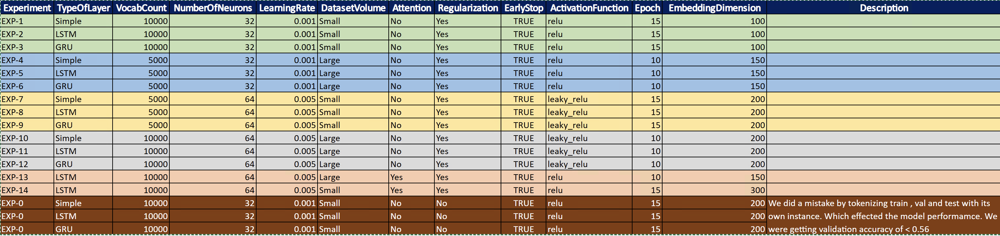
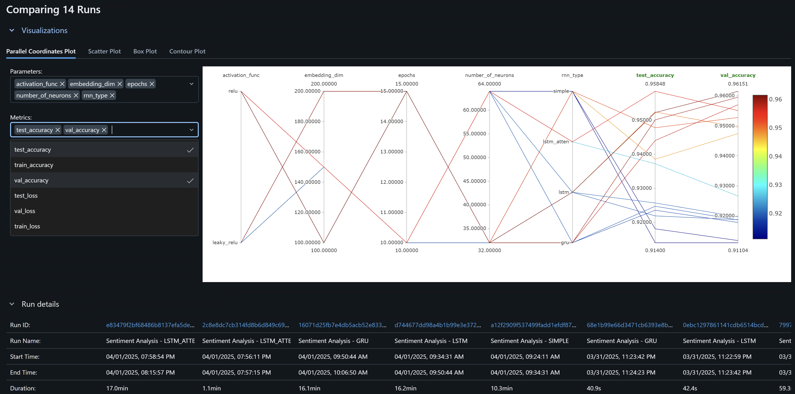
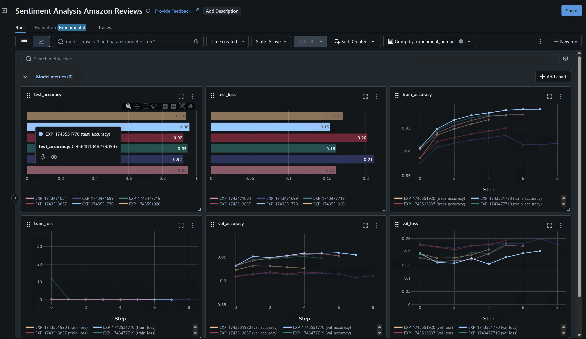

# Evaluation

## Planning

To determine the most effective model architecture and hyperparameters, a systematic experimentation process was undertaken. We explored various configurations, systematically altering parameters across different runs. Key aspects tested included the type of recurrent layer (Simple RNN, LSTM, GRU), the vocabulary size used for tokenization (5000 or 10000 words), the number of neurons in the recurrent layer (32 or 64), the learning rate for optimization (0.001 or 0.005), and the activation function (ReLU or Leaky ReLU). We also experimented with different dataset sizes ('Small' vs. 'Large') and toggled the use of mechanisms like Attention layers and Early Stopping to prevent overfitting. Each unique combination of these parameters constitutes a distinct experiment. All these experiments, along with their specific configurations and resulting metrics, will be logged using MLflow. The primary metric for comparison will be the validation accuracy achieved during training, enabling us to objectively identify the highest-performing model configuration from this series of tests.

## Analysis

The above  Each line represents a single experimental run, connecting its specific parameter values and achieved metrics across the vertical axes. The color of the line corresponds to the validation accuracy, with brighter/warmer colors (like yellow/orange, towards the top of the color bar on the right) indicating higher accuracy (around 0.95-0.96) and darker/cooler colors (blue/purple, towards the bottom) indicating lower accuracy (around 0.91-0.92).

Here's a breakdown of the observations:

1.  **Parameters vs. Metrics:** The plot maps `activation_func`, `embedding_dim`, `epochs`, `number_of_neurons`, and `rnn_type` against the `test_accuracy` and `val_accuracy`.

2.  **Performance Range:** The validation and test accuracies across these 14 runs range roughly from a low of about 0.91 to a high of approximately 0.96.

3.  **Key Parameter Influences:**
    * **Number of Neurons:** There's a clear trend showing that runs using a higher number of neurons (the top value on the axis, likely 64 based on the earlier experiment table) consistently achieved higher validation and test accuracies (warmer colored lines). Runs with fewer neurons (likely 32) generally resulted in lower performance (cooler colored lines).
    * **Embedding Dimension:** Higher embedding dimensions (values like 200 and perhaps 150)  strongly correlated with better performance. The lines representing the highest accuracy runs predominantly pass through the upper range of this axis, while lower dimensions (like 100) are associated with lower accuracy lines.
    * **RNN Type:** The plot shows distinct clusters for different RNN types. The highest performing runs (brightest lines) are concentrated on specific points on this axis, suggesting that certain RNN types ( LSTM and perhaps GRU, based on run names below the plot and general performance expectations) significantly outperformed others ( 'Simple' RNN type, which corresponds to  lower-performing runs).
    * **Epochs:** The relationship with epochs is less direct. While the highest accuracy runs seem to cluster around 10 to 15 epochs, there isn't a strict linear correlation. Some runs with high epochs show lower performance, and one high-performing run used around 10 epochs. This suggests an optimal range exists, but the exact number of epochs interacts with other parameters.
    * **Activation Function:**  High-performing runs appear associated with multiple points on this axis, suggesting other parameters had a more dominant effect and  multiple activation functions worked well in combination with the right settings.

4.  **Validation vs. Test Accuracy:** The lines generally maintain similar relative heights between the `val_accuracy` and `test_accuracy` axes. This indicates good generalization – models that performed well on the validation set also tended to perform well on the unseen test set. The best runs achieved both high validation and high test accuracy (~0.96).

**In summary:** The parallel coordinates plot highlights that using a higher number of neurons (e.g., 64), a larger embedding dimension (e.g., 150-200), and selec3ng specific RNN architectures (likely LSTM or GRU) were crucial factors in achieving the best valida3on and test accuracies (around 0.96) in these experiments. The number of epochs showed an op3mal range rather than a simple linear trend. The results also showed good consistency between valida3on and test performance across the runs

**Additional Observations:** Based on the comparison charts for the Sen3ment Analysis experiments, several key observations 
can be made regarding model performance across different runs. The dashboard displays `test accuracy`, `test loss`, `training accuracy`, `training loss`, `validation accuracy`, and `validation loss`, allowing 
for a comprehensive evaluation.

Run EXP_1743551770 demonstrated superior performance, achieving the highest test accuracy of approximately 0.9585, significantly beher than other compared runs which showed accuracies around 0.92 or lower. This top-performing run also corresponded to the lowest test loss (around 0.17). The line graphs tracking metrics over training steps reveal expected learning curves: training accuracy generally increased while training loss decreased, eventually plateauing for most runs. `validation accuracy` curves showed improvement but with more fluctuations compared to training, while validation loss curves decreased ini3ally but flahened or slightly increased for some runs later in training, poten3ally indica3ng the point where overfiqng began. These visualizations effectively highlight EXP_1743551770 as the most successful experiment based on its strong generalization to the test set, supported by its performance trends on the validation set throughout the training process